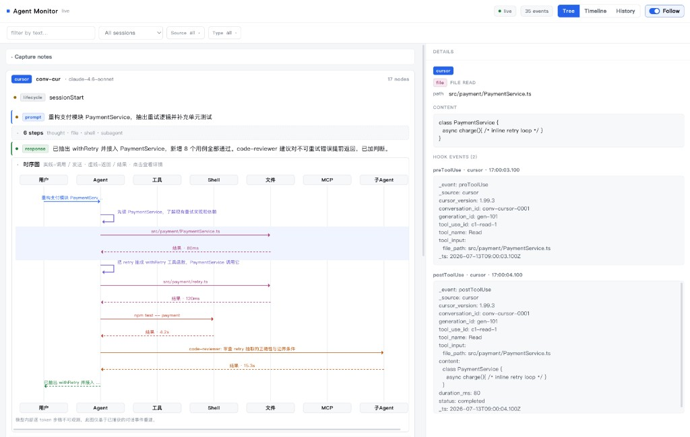

# Agent Monitor

面向 AI 编码 agent 的多引擎、基于 hook 的可观测性工具 —— **支持 Cursor、Claude Code、Codex，以及任何带命令 hook 的 agent**。它捕获 agent 的每一个动作，并实时推送到一个本地、零依赖的网页面板，提供 **树 / 时间线 / 历史** 视图、按来源着色的事件，以及基于已捕获 hook 重建的**每轮时序图**。

**天生全局：** hook 安装在 `~/.cursor/` 下，不绑定任何具体项目，因此它能同时监控你所有项目的对话。数据不出本机。

[English README](README.md)



## 捕获哪些内容

每一个 hook 事件都会追加写入本地 JSONL 日志：

- 你的 prompt、agent 的思考块与最终回复
- 每一次工具调用，含**完整的输入与结果**
- Shell 命令及其**完整输出**
- 文件读取（内容）与编辑（diff）
- MCP 调用与结果
- 子 agent：任务、类型、模型、状态、统计信息，以及它们各自的 transcript
- 会话生命周期与上下文压缩（compaction）

在会话/子 agent 结束时，还会把对话 transcript 快照进归档目录。

## 无法捕获哪些内容（平台限制）

以下内容不被任何 agent hook 暴露 —— 任何观察者都拿不到：

- 实际发送给 LLM 的完整拼装 prompt（系统 prompt、规则、序列化后的上下文）
- 逐 token 的推理 / 原始模型 API 的请求-响应
- 精确的单次调用 token 用量

一句话：**对话层**（agent 做了什么）几乎被完整捕获；**模型层**（模型逐 token 收到了什么）无法捕获。

## 架构

```
Agent (Cursor / Claude Code / Codex / …)
   │  生命周期事件 → 启动一个 hook 进程，JSON 从 stdin 传入
   ▼
scripts/capture.sh <source> → scripts/capture.mjs   (只追加、fail-open、绝不阻塞)
   │  每个事件一行 JSON（附带 _source 标签）
   ▼
~/.cursor/observer/events.jsonl
   │  watch + tail
   ▼
scripts/server.mjs  ──SSE──▶  assets/index.html   (树 + 时间线 + 历史)
```

采集 hook 只写文件（零网络、fail-open），因此永远不会阻塞或拖慢 agent。采集端 tail 日志并通过 SSE 推送更新。

## 面板

- **树 / 时间线 / 历史** 三种视图，**来源过滤** + **类型过滤**、文本过滤、会话选择器
- **树视图：** 会话按**最近活动时间倒序**（最新在上）；同一会话内轮次仍按时间正序（`prompt → 步骤 → 回复`）
- **每轮时序图：** 固定七条泳道（用户、Agent、工具、Shell、文件、MCP、子 Agent）。实线 = 调用/发送，虚线 = 返回/结果。**默认展开**；中间步骤列表**默认折叠**。点击任意箭头可打开详情。展开状态下会随事件流实时更新。
- **Follow：** 树视图停靠**顶部**（最新会话）；时间线停靠**底部**（最新事件）。向上/下滚动可暂停，滚回边缘恢复。
- 点击任意节点查看丰富的详情视图（正文、终端输出、文件 diff、工具 I/O、子 agent 统计），并提供原始 JSON 兜底

## macOS 菜单栏 App

将 Agent Monitor 打包为原生 macOS 菜单栏应用，无需手动启动 `server.mjs`：

```bash
sh scripts/build-macos-app.sh
# 产物: macos/build/Build/Products/Release/Agent Monitor.app
open "macos/build/Build/Products/Release/Agent Monitor.app"
```

**功能：**

- 菜单栏图标实时显示 agent 活动状态（idle / live / active / offline）
- 点击菜单查看精简摘要（来源、最近事件、计数）
- **Open Panel**（⌘O）打开完整监控窗口（复用 Web 面板）
- **Install Hooks…** 一键注册 Cursor / Claude Code hooks
- **Launch at Login** 开机自启

App 内嵌 HTTP+SSE 服务（默认 `http://127.0.0.1:4517`），与 CLI 版 `server.mjs` API 兼容。若端口被占用，请先退出旧的 `node server.mjs` 进程。

每次构建会通过 `scripts/sync-macos-assets.sh` 将最新 `assets/` 同步进 app bundle。

**要求：** macOS 13+，Xcode 15+（用于构建）。本地开发可 ad-hoc 签名；分发给他人需使用 Developer ID 签名并 notarize。

## 安装

```bash
sh install.sh
```

这会把采集/面板脚本拷贝到一个与项目无关的位置
（`~/.cursor/agent-monitor`），并注册 **Cursor** 用户 hook（合并，不会覆盖已有配置）。安装后重新加载 Cursor 窗口即可。

启动面板：

```bash
node ~/.cursor/agent-monitor/scripts/server.mjs
# 打开 http://127.0.0.1:4517  （设置 OBSERVER_PORT 可更改端口）
```

## 监控更多 agent

所有 agent 都会汇入同一个面板，按来源打标签并着色。可直接复制的配置见
[`docs/multi-agent.md`](docs/multi-agent.md)：

- **Cursor** —— 由 `install.sh` 自动配置
- **Claude Code** —— 把 [`adapters/claude-code.settings.json`](adapters/claude-code.settings.json) 合并进 `~/.claude/settings.json`
- **Codex** —— 见 [`adapters/codex.hooks.json`](adapters/codex.hooks.json)
- **任意 agent** —— 把它的命令 hook 指向 `~/.cursor/agent-monitor/scripts/capture.sh <your-source-name>`；如果它使用了新的事件名，在 `assets/index.html` 的 `EVENT_ALIASES` 中补充即可。

## 数据与隐私

所有数据都保存在本机的 `~/.cursor/observer/` 下。该日志可能包含**你所有项目的文件内容、shell 输出和 prompt** —— 请当作敏感数据对待。随时删除该目录即可重置。

## 许可证

MIT —— 见 [LICENSE](LICENSE)。
